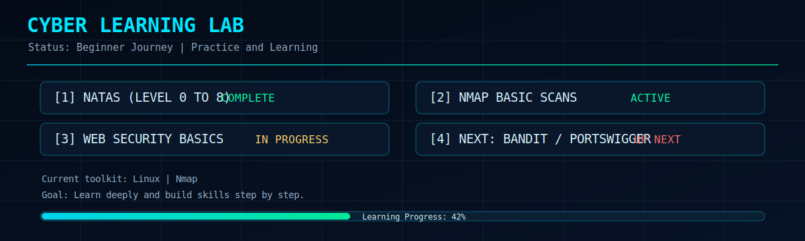
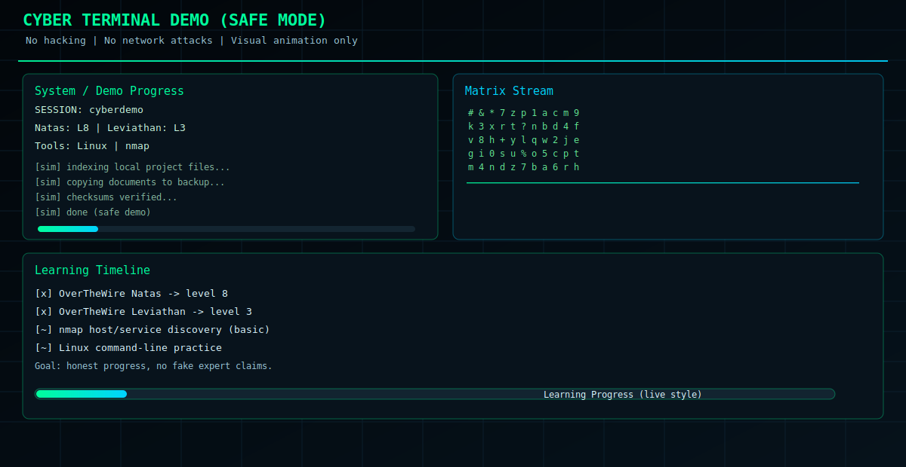

<div align="center">

<!-- DYNAMIC_VENOM_HEADER_START -->

<!-- DYNAMIC_VENOM_HEADER_END -->


<br/>

</div>

---

<h2 align="center"> About Me</h2>

```javascript

const mohamad = {
    education: [
        "Student of CS in Sorbonne University",
        "Student in Ecole 42 Paris"
    ],
    languages: ["HTML", "CSS", "Markdown", "Java", "Python", "Dart", "C", "SQL", "Bash"],
    tools: ["Git", "GitHub", "Linux"]
};
```
<!--  -->


<p align="center">
Passionate about scalable backend systems • Modern frontend engineering • AI-powered integrations
</p>

---

<h2 align="center"> Tech Stack</h2>

<div align="center">

<table>
<tr>

<td width="50%">
<div align="center" style="background:#1f883d;padding:25px;border-radius:18px;">
<h3>Languages</h3>
<br/>


</div>
</td>

<td width="50%">
<div align="center" style="background:#f85149;padding:25px;border-radius:18px;">
<h3>Tools</h3>
<br/>


</div>
</td>

</tr>
</table>

</div>

---
<h2 align="center"> GitHub Analytics</h2>

<div align="center">
<h3>Live data from <a href="https://github.com/ABONASIMI" target="_blank">github.com/ABONASIMI</a></h3>

</div>

<div align="center">

</div>

<div align="center">

</div>

<div align="center">

</div>

---
<h2 align="center"> Cybersecurity Learning</h2>

<div align="center">


</div>

<p align="center">I am learning cybersecurity step by step through labs and CTF practice (Natas level 8 and Leviathan level 3).</p>

<div align="center">

</div>

---
<h2 align="center"> Cyber Demo Animation</h2>

<p align="center"><strong>Safe simulation only</strong> - terminal aesthetics, no hacking, no real credentials, no network attacks.</p>

<div align="center">

</div>

<div align="center">

</div>

```bash
# Run safe cyber demo animation from this repo
bash scripts/cyber_show_demo.sh
```

---

<h2 align="center">
 Random Dev Quote</h2>

<div align="center">

</div>

---

<div align="center">


</div>
